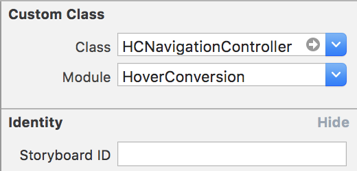
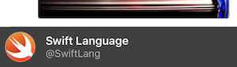

# HoverConversion

[](https://developer.apple.com/iphone/index.action)
[](https://developer.apple.com/swift)
[](http://cocoapods.org/pods/HoverConversion)
[](https://github.com/Carthage/Carthage)
[](http://cocoapods.org/pods/HoverConversion)

[ManiacDev.com](https://maniacdev.com/) referred.  
[https://maniacdev.com/2016/09/hoverconversion-a-swift-ui-component-for-navigating-between-multiple-table-views](https://maniacdev.com/2016/09/hoverconversion-a-swift-ui-component-for-navigating-between-multiple-table-views)

 

HoverConversion realized vertical paging with UITableView. UIViewController will be paging when reaching top or bottom of UITableView's contentOffset.

## Featrue

- [x] Vertical paging with UITableView
- [x] Seamless transitioning
- [x] Transitioning with navigationView pan gesture
- [x] Selected cell that related to UIViewController is highlighting
- [x] Support Swift2.3
- [x] Support Swift3

To run the example project, clone the repo, and run `pod install` from the Example directory first.

## Installation

HoverConversion is available through [CocoaPods](http://cocoapods.org). To install
it, simply add the following line to your Podfile:

```ruby
pod "HoverConversion"
```

## Usage

If you install from cocoapods, You have to write `import HoverConversion`.

#### Storyboard or Xib



Set custom class of `UINavigationController` to `HCNavigationController`. In addition, set module to `HoverConversion`.
And set `HCRootViewController` as `navigationController`'s first viewController.

#### Code

Set `HCNavigationController` as `self.window.rootViewController`.
And set `HCRootViewController` as `navigationController`'s first viewController.

#### HCPagingViewController

If you want to show vertical contents, please use `HCPagingViewController`.

```swift
let vc = HCPagingViewController(indexPath: indexPath)
vc.dataSource = self
navigationController?.pushViewController(vc, animated: true)
```

#### HCContentViewController

A content included in `HCPagingViewController` is `HCContentViewController`.  
Return `HCContentViewController` (or subclass)  with this delegate method.

```swift
extension ViewController: HCPagingViewControllerDataSource {
    func pagingViewController(viewController: HCPagingViewController, viewControllerFor indexPath: NSIndexPath) -> HCContentViewController? {
        guard 0 <= indexPath.row && indexPath.row < twitterManager.users.count else { return nil }
        let vc = UserTimelineViewController()
        vc.user = twitterManager.users[indexPath.row]
        return vc
    }
}
```

#### HCNextHeaderView



Return `HCNextHeaderView` (or subclass)  with this delegate method.

```swift
extension ViewController: HCPagingViewControllerDataSource {
    func pagingViewController(viewController: HCPagingViewController, nextHeaderViewFor indexPath: NSIndexPath) -> HCNextHeaderView? {
        guard 0 <= indexPath.row && indexPath.row < twitterManager.users.count else { return nil }
        let view = NextHeaderView()
        view.user = twitterManager.users[indexPath.row]
        return view
    }
}
```

#### Stop transitioning

If you want to load more contents from server and want to stop transitioning, you can use `canPaging` in `HCContentViewController`.

```swift
//Stop transitioning to previous ViewController
canPaging[.prev] = false //Default true

//Stop transitioning to next ViewController
canPaging[.next] = false //Default true
```

## Requirements

- Xcode 7.3 or greater
- iOS 8.0 or greater
- [MisterFusion](https://github.com/marty-suzuki/MisterFusion) - Swift DSL for AutoLayout

## Special Thanks

Those OSS are used in sample project!

- [TouchVisualizer](https://github.com/morizotter/TouchVisualizer) (Created by [@morizotter](https://github.com/morizotter))
- [TwitterKit](https://docs.fabric.io/apple/twitter/overview.html#)

## Author

marty-suzuki, s1180183@gmail.com

## License

HoverConversion is available under the MIT license. See the LICENSE file for more info.
